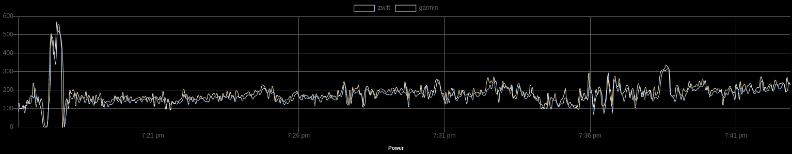

# fit2compare

Sencillo visualizador y comparador de ficheros Garmin FIT.

Herramienta sencilla para visualizar un fichero Garmin FIT o comparar dos orígenes de datos.

## Funciones básicas:

- Carga de ficheros FIT y visualización de potencia, pulso, cadencia, elevación y un resumen de la actividad.
- Exportación de **todos** los datos del fichero FIT en formato JSON para un análisis posterior.
- Exportación de los datos **visualizados** en formato XLSX para un análisis posterior.
- Comparación de potencia, pulso y cadencia entre dos ficheros FIT de una misma actividad. Por ejemplo el fichero generado por Zwift y otro generado por un dispositivo Garmin.
- Comparación de medidores de potencia, bandas de pulso y medidores de cadencia.
- Todo el análisis se realiza en el navegador.
- Soporte multilenguaje.

[Demo](https://ea1nk.github.io/fit2compare/)

# fit2compare
Simple Garmin FIT file viewer and comparator.

## Basic functions

- Visualization of power, heart rate,cadence and elevation measures and a brief activity resume from the loaded FIT file.
- Export **all** the data from the FIT file in JSON format for further analysis.
- Export **visualized** data from the FIT file in XLSX format for further analysis.
- Power, heart rate and cadence comparison between two FIT files. For example a Zwift generated file and a Garmin device  recorded activity.
- Power meters, heart rate measuring devices and cadence meter sensor comparisons.
- In-browser complete analysis.
- Multilanguage support.

[Demo](https://ea1nk.github.io/fit2compare/)
